##   Table of Contents:
- [What are Ringcodes](#what-are-ringcodes)
- [Mastering Codes](#mastering-code)
- [Mastering SID](#mastering-sid)
- [Toolstamp](#toolstamp)
- [Mould SID](#mould-sid)
- [Putting it all together](#putting-it-all-together)
- [Considerations](#considerations)


## What are Ringcodes?
Have you ever looked at the backside of an optical disc and noticed the small letters/numbers? Have you ever asked yourself "huh, why are these here and why do I need them?" 

These are all perfectly normal questions to ask yourself. It isn't like the meaning is clearly advertised to you or anything. 

As it turns out, ringcodes serve to identify the disc's origins from uniquely the disc itself, to identifying the facility that the disc itself was mastered in, to the specific machine that pressed the disc itself. If you've ever wondered, you've come to the correct place. 

As an example, here's the backside of a UMD-ROM disc. These are ringcodes.
<p align=left>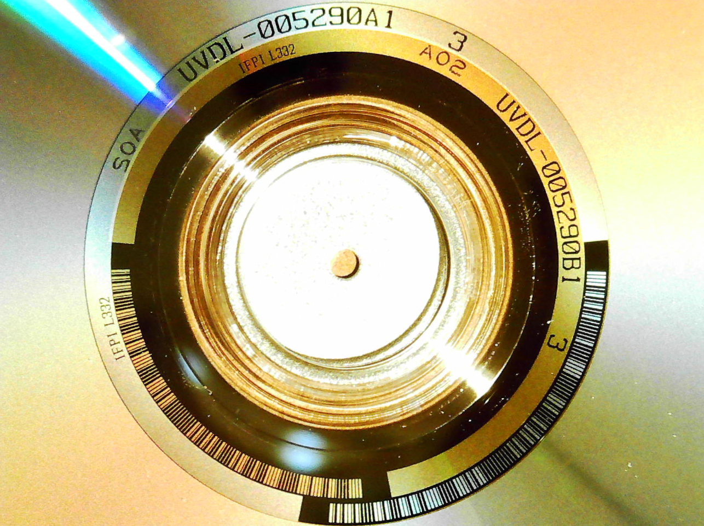</p> 

Unfortunately, due to how small ringcodes can be, reading and trying to discern what they are can be very tricky to the unaided eye. However, you do **NOT** need to remove your disc from the UMD housing to read them. If you have trouble identifying ringcodes for yourself due to their smaller size, consider purchasing some sort of magnification device.
Here are some recommended options that I find work exceptionally well. 

**These are not the only options by any means, and I am not affiliated with any of these listings.**

- [EnTeck 30X 60X Dual Lens LED Illuminated Jewelry Magnifier, Pocket Microscope Magnifying Jewelers Eye Loupe Glasses](https://www.amazon.com/dp/B01JOO2EGK)

- [Carson TriView 5x/10x/15x Folding Loupe Magnifier with Built-in Case, 3-in-1 Portable Loupe Magnifying Glass - Adjustable Magnification, Great for Jewelry (TV-15)](https://www.amazon.com/dp/B00BUGYKPE)

- [JARLINK 2 Pack Jewelers Loupe, 30X 60X 90X Illuminated Jewelers Eye Magnifier and Magnifying Glass Loop with UV Black Light and Bright LED Light for Gems, Jewelry, Diamond, Coins, Stamps (Black)](https://www.amazon.com/dp/B08RSB7S79) 


- [Plugable Digital Microscope with Flexible Arm Observation Stand Compatible with USB and USB-C Windows, macOS, ChromeOS, iPad (USB C), Android, Linux Systems (2MP, 250x Magnification)](https://www.amazon.com/dp/B00XNYXQHE)

- [AIXPI Magnifying Glass with Light, 30X Handheld Large Magnifying Glass 12 LED Illuminated Lighted Magnifier for Macular Degeneration Seniors Reading Inspection Coins Jewelr Visit the AIXPI Store](https://www.amazon.com/dp/B07G55FSPX)

- [Magnetic Helping Hand, Soldering Helping Hands, PCB Circuit Board Holder with 3X LED Magnifying Lamp, Flexible Metal Arms Heavy Duty Base Electronic Repair Tool (Magnetic with Lamp)](https://www.amazon.com/gp/product/B08Y12QC73)

- [Magnifying Glass with Light, 30X Handheld Magnifying Glass, 12 LED Illuminated Lighted Magnifier for Low Vision Seniors Reading, Macular Degeneration, Soldering, Inspection, Coins, Jewelry, Exploring](https://www.amazon.com/dp/B09Q95KJCJ)

If you have any devices you personally prefer, feel free to either let me know so I can add them to the list, or open a pull-request to add them to the list yourself.
<br>

## Layers

Without going into the specifics of optical disc manufacturing, it's necessary to first start off with a general outline of what constitutes a UMD-ROM disc. 

As outlined in the ECMA-365 standard, a UMD-ROM disc is constituted of two types (type A and B respectively)

- a single layer disk with a max capacity of 0.9 Gigabytes
- a dual layer disk with a max capacity of 1.8 Gigabytes 

So what then is a layer? Without getting into a complex lower-level explanation, you can easily think of a layer as the space of the disk that data is written to. This means that dual-layer UMD-ROMs can fit twice as much data as a single-layer UMD-ROM as they have twice as many layers. This also means each layer is reprensented by its own set of ringcodes.

This following disc is a **dual-layer** disc. 

I've highlighted each layer's corresponding ringcodes in a different color, marking Layer 1 and Layer 2 respectively. Layers are visually read from the outside to the inside. We will be using Layer 1 to denote the outer layer, and Layer 2 to denote the inner layer.
<br>

- Outer/Layer 1 = **<span style="color:#ff0000">RED</span>**
- Inner/Layer 2 = **<span style="color:#00ddff">LIGHT BLUE</span>**

<p align=left>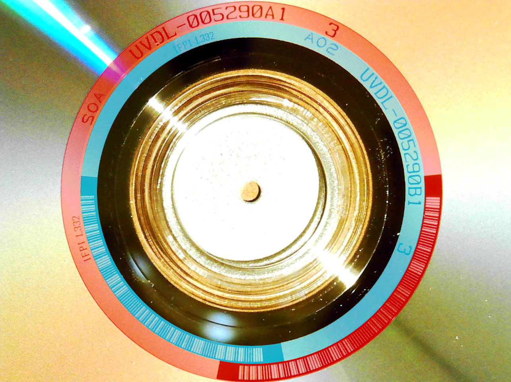</p> 

Knowing this is incredibly vital to properly notating ringcodes, as you must know which layer the ringcodes belong to.
<br>

## Mastering Code

A mastering code typically contains letters and numbers that refer to contents on the disc or relevant information that can be attributed to the specific release itself. While appearance and formation of these codes can differ depending on the disc, release type, and platform, UMD-ROMs typically have a relatively easy to understand format for the mastering code. 

Typically formatted with a four-letter prefix, six numbers, an A1 or B1 to denote the specific layer itself, and finally three spaces followed by a random number. 

**This is not a hard rule and mastering codes can generally be formatted any specific way!**

As these codes can generally represent a number of specific, no part of this sequence can be assumed to mean a partictular thing **no matter** how similar certain fields may seem. In many cases you will also find text written along the mastering code such as "Sony DADC." Include this text as part of the mastering code line, respecting and entering as many spaces before and after it as it appears.

For this specific example disc, we have the UMD-ROM for the UMD-Video - Batman The Movie

<p align=left>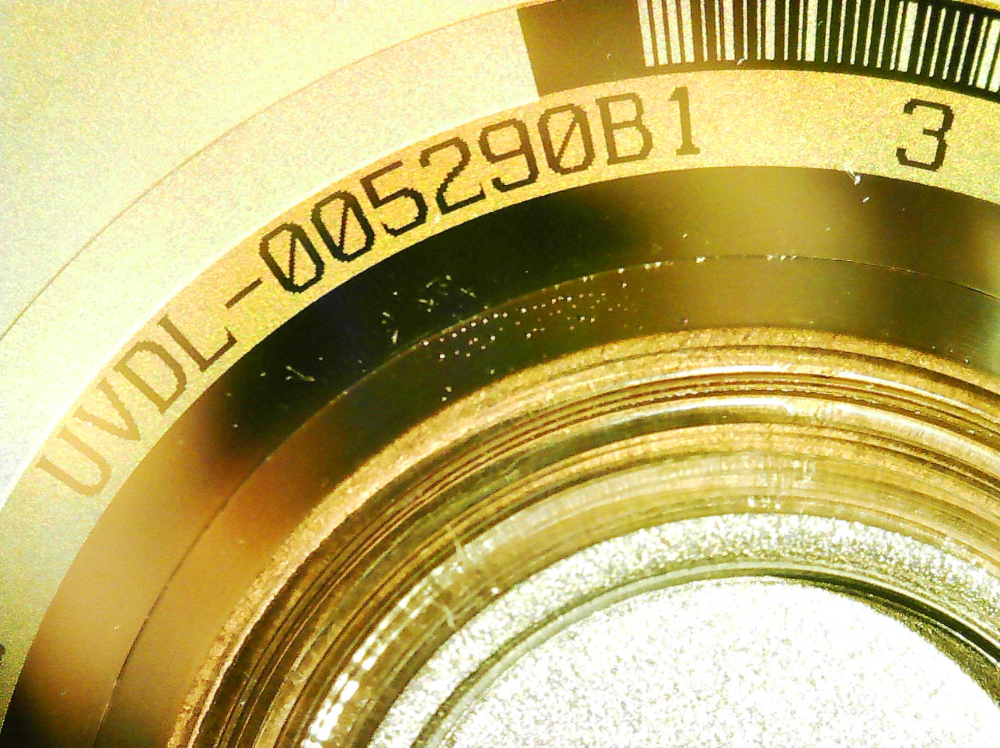</p> 

The mastering code as listed in this photo would be:
```sh
UVDL-005290B1   3
``` 

<p align=left>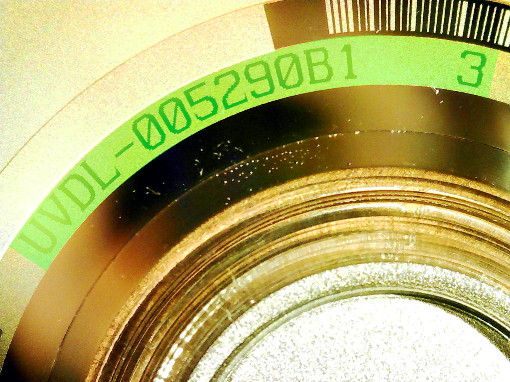</p> 

For further reference purposes, i've highlighted this layer 2 mastering code in **<span style="color:#00ff2e">LIGHT GREEN</span>**
<br>

## Mastering SID

The mastering SID exists as a way to identify and trace all optical discs back to the specific plant that they were manufactured/replicated in and provide a way to identify the specific machine's laser beam recorder or mould that was responsible for initial disc or stamping of disc itself.

The **Source ID (SID)**, was initially created in 1994 by the **International Federation of the Phonographic Industry (IFPI)** as a way to combat disc piracy and allow for a finer level of quality control to disc manufacturing itself. As UMD-ROMs are a form of optical media, they are no exception to this policy and as such are printed with Mastering and Mould SIDs (we'll get to the latter further down this document, [here](#mould-sid).)

The Mastering SID itself is represented with the abbreviation of the International Federation of the Phonographic Industry, **IFPI**, followed by an **L**, and finally a combination of 3-4 numbers. The numbers rare unique to the specific plant that manufactured/pressed the disc itself and essentially a form of serial number. All mastering SIDs will begin with ``IFPI L``

<p align=left>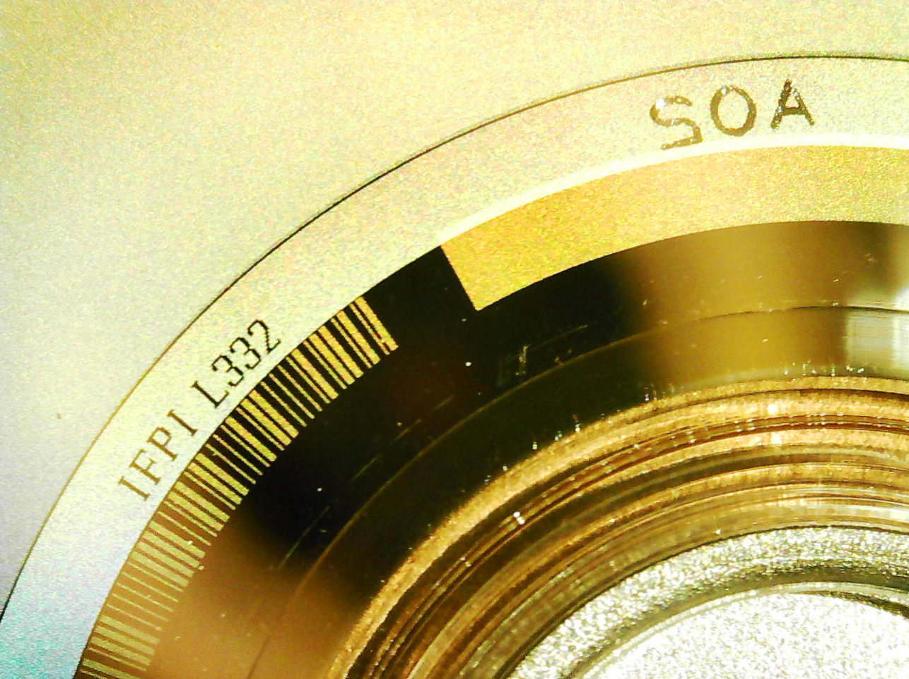</p> 

For this specific disc, example, the mastering SID is ``IFPI L332`` which corresponds to the **Sony DACD Mastering Facility** located in USA. 

For all future reference in this document, the mastering SID will be highlighted in **<span style="color:#006bff">BLUE</span>** to help further distinguish it from the rest.

<p align=left>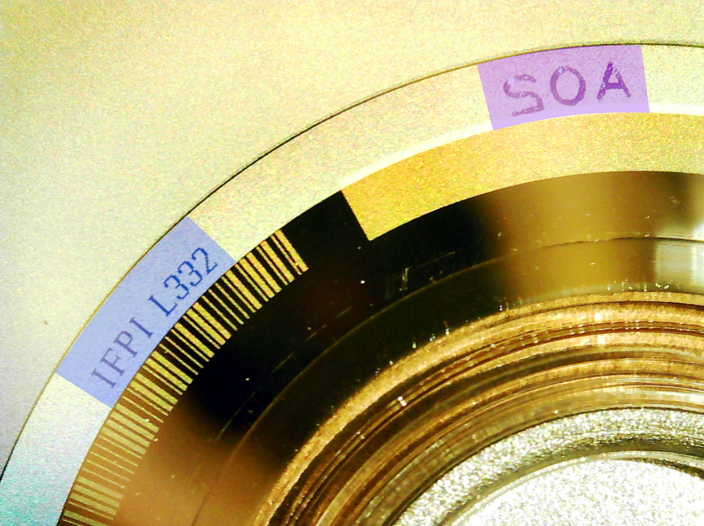</p> 
<br>

## Toolstamp

The toolstamp is a letter followed by two numbers that's typically, (but not always!), added by the pressing plants to further distinguish discs.

In many cases you will find one of the layer toolstamps printed backwards to how you would normally read it. This is one such example of the layer 1 toolstamp **A02**, printed backwards to what it is. Even in these circumstances, you would write them as the intended toolstamp and not as it appears (although you're free to note that should you choose.)

The toolstamp **A02** will be highlighted in **<span style="color:#af00ff">PURPLE</span>** for the remainder of this document. 

<p align=left></p> 
<br>

## Mould SID

As mentioned in the above [mastering SID](#mastering-sid) section, the IFPI body declares another type of source ID (SID) marking to be used along side the mastering SID as a way to provide authenticity and quality-control towards the manufacturing procedure. However, these codes are about 90% smaller than the aforementioned ringcodes we are looking for and not evey UMD-ROM will have one of these. Due to this and overall quality issues with the initial stamping process of mould itself, these can be nearly impossible to discern even with magnification tools.

As such, don't worry about logging them for now. but if you want to for completeness (highly recommended), they will take a similar form as the mastering SID, ie; IFPI followed by 4 letters/numbers. 

As an example of where one would find the mould SID and how difficult they can be to see, here are some example images detailing the magnification necessary as well as legibility issues.

This is what a mould SID looks like (from the UMD-Music Metallica release)

<p align=left>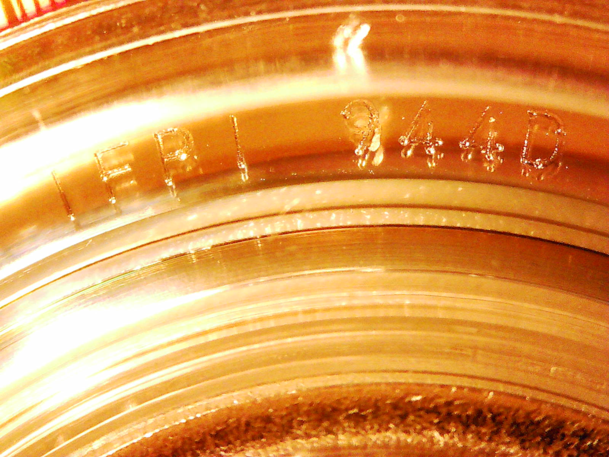</p> 

**IFPI 944D** is what it appears to be, but it's hard to be sure. This is already extremely magnified, but it was taken through the shell. Removing the shell to read the mould SID can in some circumstances make it easier to see (more on this in another section.)

These next photos will just be me zooming out so you can get an idea of how hard they are to see.

<p align=left>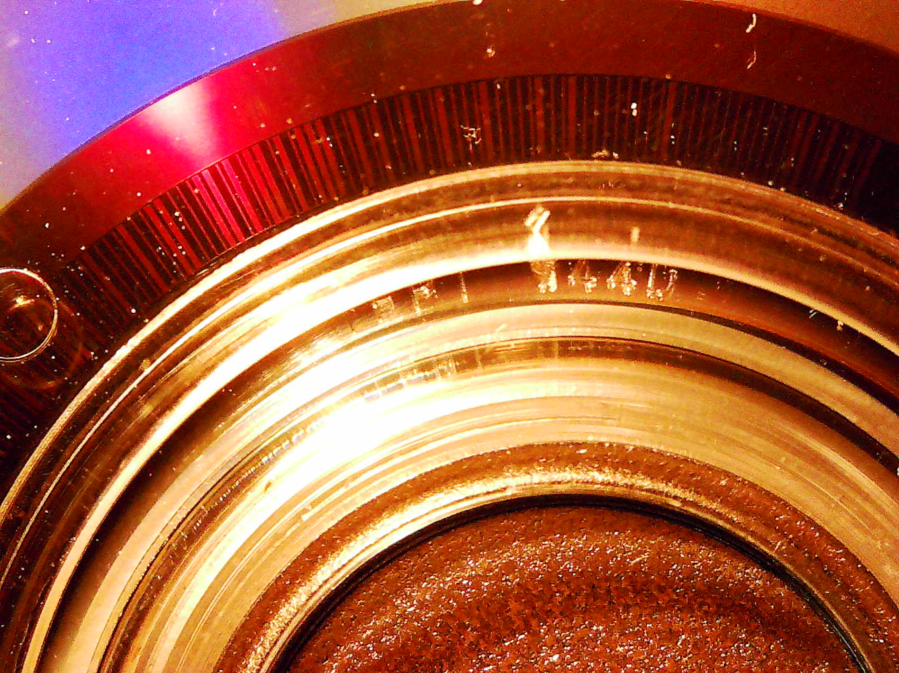</p> 

Still see it?

<p align=left>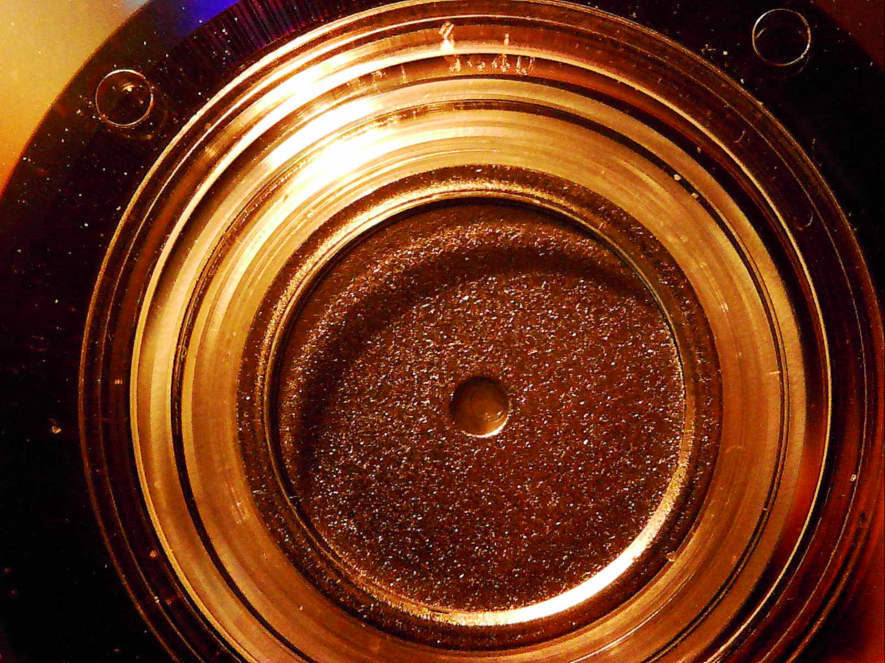</p> 

How about now?

<p align=left>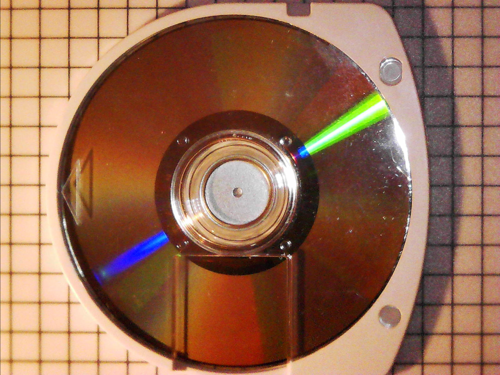</p> 

Hopefully you get the idea. Identifying mould SIDs can be a pain. If you want to try your hand, be my guest. 

Your attempts will be ***much*** appreciated.
<br>

## Putting it all together

Finally... the most important part of this document. How to format all of the ringcodes and write them in a way that allows you to know what they mean. 

Just to clarify, these are the colors you will see to represent the different ringcodes.


- Outer/Layer 1 = **<span style="color:#ff0000">RED</span>**
- Inner/Layer 2 = **<span style="color:#00ddff">LIGHT BLUE</span>**
- Mastering Code in **<span style="color:#00ff2e">LIGHT GREEN</span>**
- Mastering SID in **<span style="color:#006bff">BLUE</span>**
- Toolstamp in **<span style="color:#af00ff">PURPLE</span>**

We'll log the ringcodes in a way that respects their location, by disclosing Layer 1 and Layer 2 ringcodes respectively. 

To begin logging the ringcodes for this disc, we'll first determine whether or not it is a single or dual layer disc. 

<p align=left></p>

Because we see codes written on both outer and inner rings, we know this is a **Dual Layer** UMD-ROM.

<p align=left></p> 

With all the ringcodes presented, we'll write them down as follows:

- ``Layer 1 (Outer):``
  - ``[Mastering Code]``
  - ``[Mastering SID]``
  - ``[Toolstamp]``
  - ``[Mould SID]``

- ``Layer 2 (Inner):``
  - ``[Mastering Code]``
  - ``[Mastering SID]``
  - ``[Toolstamp]``
  - ``[Mould SID]``

<br>
<p align=left>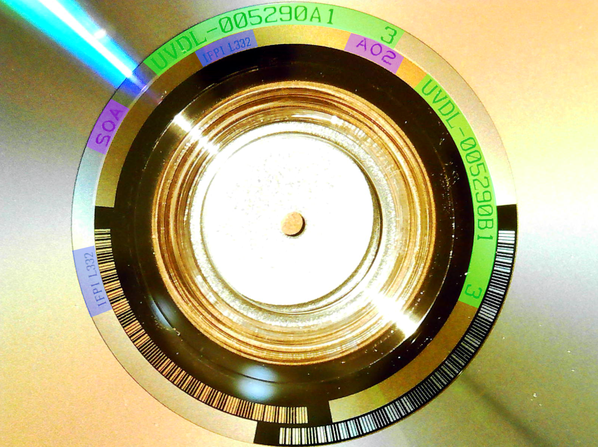</p> 

This discs ringcodes would be written as such:

- ``Layer 1 (Outer):``
  - ``UVDL-005290A1   3``
  - ``IFPI L332``
  - ``A02``
  - ``n/a``

- ``Layer 2 (Inner):``
  - ``UVDL-005290B1   3``
  - ``IFPI L332``
  - ``A02``
  - ``n/a``

That's all there is to it! Here are some edge-case/important things to consider:
<br>

# Considerations

- If you are **sure** a specific ringcode is not present, just leave the field blank or write 
``n/a``
- If you are not logging Mould SID, leave the field blank or write 
``n/a`` (in many cases mould sid can be blanket derived from other releases.)
- If you come across any strange looking symbols, see [Symbols](#symbols) (TBA/WIP), but know that you do not need to include them. 
- Most importantly, if you're having trouble with making out a specific ringcode, just ask!
- If you are still unsure of what a specific ringcode is, omit it and write your best guess as a notated comment. Incomplete ringcodes are better than no ringcodes  
- If you feel this document doesnt cover something it should or you think something can be explained better than it was, don't hesitate to reach out and let me know. Comments, critique and criticism are fully welcome!
